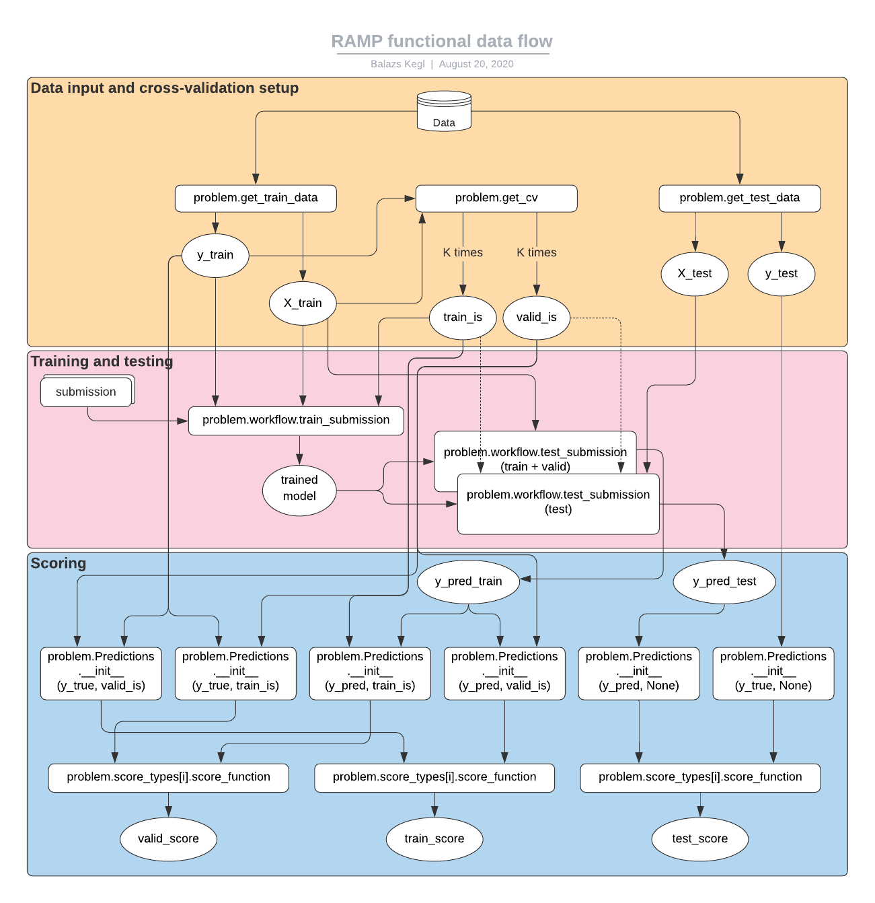

.. _scoring:

RAMP execution
##############

RAMP implements a **double cross-validation scheme**: submissions are trained on each training fold, then tested on each validation fold and on the held out test set. This assures **proper model evaluation** when models are tuned using validation scores.

Training and scoring a submission
=================================

When running the ``ramp-test`` script locally, the starting kit submission is trained, tested, and scored. The output contains all the training, validation, and test scores and wall clock times for all *K* folds. At the end we provide two summaries: the classical mean scores over the *K* folds, and the scores achived by ensembling all the *K* foldwise models, a technique called CV-bagging (we typically take the mean prediction of the *K* models on each test point) ::

    λ ramp-test
    Testing Titanic survival classification
    Reading train and test files from ./data/ ...
    Reading cv ...
    Training submissions/starting_kit ...

    CV fold 0
            score   auc   acc   nll      time
            train  0.84  0.79  0.47  0.482708
            valid  0.92  0.83  0.38  0.007979
            test   0.86  0.84  0.43  0.005988
    CV fold 1
            score   auc   acc   nll      time
            train  0.85  0.82  0.46  0.009974
            valid  0.86  0.78  0.46  0.003989
            test   0.84  0.83  0.46  0.010971
    CV fold 2
            score   auc   acc   nll      time
            train  0.87  0.79  0.44  0.009975
            valid  0.80  0.82  0.49  0.006979
            test   0.86  0.84  0.44  0.004987
    CV fold 3
            score   auc   acc   nll      time
            train  0.85  0.81  0.46  0.011969
            valid  0.87  0.81  0.43  0.004986
            test   0.86  0.85  0.43  0.010972
    CV fold 4
            score   auc   acc   nll      time
            train  0.85  0.82  0.45  0.009975
            valid  0.84  0.79  0.47  0.005984
            test   0.84  0.82  0.45  0.006009
    CV fold 5
            score   auc   acc   nll      time
            train  0.84  0.80  0.46  0.013964
            valid  0.88  0.78  0.42  0.005983
            test   0.86  0.84  0.43  0.010006
    CV fold 6
            score   auc   acc   nll      time
            train  0.87  0.81  0.44  0.009999
            valid  0.79  0.75  0.52  0.004964
            test   0.84  0.83  0.45  0.005982
    CV fold 7
            score   auc   acc   nll      time
            train  0.84  0.79  0.47  0.010975
            valid  0.90  0.83  0.42  0.008975
            test   0.85  0.84  0.44  0.007978
    ----------------------------
    Mean CV scores
    ----------------------------
            score           auc          acc           nll        time
            train  0.85 ± 0.011  0.8 ± 0.012  0.46 ± 0.012  0.1 ± 0.16
            valid  0.86 ± 0.044  0.8 ± 0.028  0.45 ± 0.041   0.0 ± 0.0
            test   0.85 ± 0.008  0.84 ± 0.01  0.44 ± 0.009   0.0 ± 0.0
    ----------------------------
    Bagged scores
    ----------------------------
            score   auc   acc   nll
            valid  0.84  0.79  0.47
            test   0.86  0.85  0.44

When using a RAMP challenge (`RAMP studio`_), the bagged validation score is displayed on the public leaderboard, and the bagged test score is used privately to determine the final rankings.

Other submissions can be trained and scored using the ``--submission`` switch, and the result of the training can be saved using the ``--save-output`` switch. See :ref:`command-line` for all the command-line options.

The functional data flow
========================

This flowchart shows what happens when ``ramp-test`` is executed. You can see how the data, elements in ``problem.py``, and the submission interact. This is useful for those who would like to see what happens under the lid, and for those who would like to implement their own customized RAMP workflows.

1. The data is loaded by calling ``problem.get_train_data`` and ``problem.get_test_data``.
2. The training data is passed to ``problem.get_cv`` which yields the CV fold objects, typically *K* pairs of training indices and validation indices.
3. The training data (``X_train`` and ``y_train``), and the training indices are passed to ``problem.workflow.train_submission``. This function imports the submission files and calls the appropriate training functions (typically ``fit`` and ``transform``) implemented in the submission. It can also contain "glue" code: fixed data processing and transformation steps before, after, or between trained steps (implemented by the submission).
4. The trained model is passed to ``problem.workflow.test_submission`` twice (per fold): once for computing the training and validation predictions (on ``X_train``), and once for computing the test predictions (on ``X_test``).
5. Six ``workflow.Predictions`` objects are created (per fold), three on the ground truth and three on the predictions. The training and validation predictions are both created from ``y_pred_train`` and ``y_train`` in ``workflow.Predictions.__init__`` using the training and validation indices.
6. The corresponding pairs of ground truth and predictions are passed to each ``problem.score_types[i].score_function`` which returns a scalar score.

Testing manually
----------------

Sometimes it is useful to execute elements of RAMP manually, for example to obtain predictions or the trained model interactively in a notebook. The following sequence can be run on any RAMP, line by line. It does not use the cross validation so it can be used to debug the workflow once the
following elements are defined in problem.py::

    get_train_data
    get_test_data
    Predictions
    workflow
    score_types

The sequence to execute (assuming you are in the same folder with `problem.py`)::

    from rampwf.utils import assert_read_problem
    problem = assert_read_problem()

    X_train, y_train = problem.get_train_data()
    X_test, y_test = problem.get_test_data()

    trained_workflow = problem.workflow.train_submission(
        'submissions/starting_kit', X_train, y_train)
    y_pred_test = problem.workflow.test_submission(
        trained_workflow, X_test)
    test_predictions = problem.Predictions(y_pred=y_pred_test)
    test_ground_truth = problem.Predictions(y_true=y_test)
    for score_type in problem.score_types:
        score = score_type.score_function(
            test_ground_truth, test_predictions)
        print(f'{score_type.name} = {score}')

On titanic, it should produce::

    auc = 0.8628342245989303
    acc = 0.8539325842696629
    nll = 0.43442182924613426

Once `problem.get_cv` is defined, the following sequence implements the full data flow (modulo formatting, saving, and modularizing, it is identical to `ramp-test`) ::

    from rampwf.utils import assert_read_problem
    problem = assert_read_problem()

    X_train, y_train = problem.get_train_data()
    X_test, y_test = problem.get_test_data()
    cv = problem.get_cv(X_train, y_train)

    for fold_i, (train_is, valid_is) in enumerate(cv):
        print(f'fold {fold_i}:')
        trained_workflow = problem.workflow.train_submission(
            'submissions/starting_kit', X_train, y_train, train_is)
        y_pred_train = problem.workflow.test_submission(
            trained_workflow, X_train)
        y_pred_test = problem.workflow.test_submission(
            trained_workflow, X_test)
        train_predictions = problem.Predictions(
            y_pred=y_pred_train, fold_is=train_is)
        valid_predictions = problem.Predictions(
            y_pred=y_pred_train, fold_is=valid_is)
        test_predictions = problem.Predictions(y_pred=y_pred_test)
        train_ground_truth = problem.Predictions(
            y_true=y_train, fold_is=train_is)
        valid_ground_truth = problem.Predictions(
            y_true=y_train,fold_is=valid_is)
        test_ground_truth = problem.Predictions(y_true=y_test)
        for score_type in problem.score_types:
            train_score = score_type.score_function(
                train_ground_truth, train_predictions)
            valid_score = score_type.score_function(
                valid_ground_truth, valid_predictions)
            test_score = score_type.score_function(
                test_ground_truth, test_predictions)
            print(f'\ttrain {score_type.name} = {train_score}')
            print(f'\tvalid {score_type.name} = {valid_score}')
            print(f'\ttest {score_type.name} = {test_score}')

.. _RAMP Studio: https://ramp.studio/
