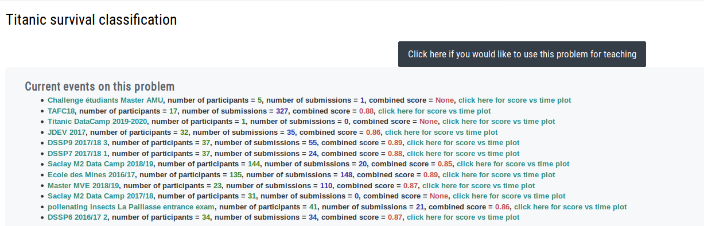

.. _using-kits:

Using RAMP starting-kits
########################

To get started working on an existing RAMP challenge:

1. Clone the `starting kit`_ for the challenge from GitHub:

   .. code-block:: bash
    
    $ git clone https://github.com/ramp-kits/<ramp_kit_name>.git
    $ cd <ramp_kit_name>

   If the starting kit does not include the data (i.e. a ``data/`` folder)
   you will need to download the data using the ``download_data.py`` file:

   .. code-block:: bash

    $ python download_data.py

2. Install dependencies:

   * with `conda <https://docs.conda.io/en/latest/miniconda.html>`_ to create
     a virtual environment with all the required dependencies:

     .. code-block:: bash

        # to create the environment
        $ conda env create -f environment.yml
        # to activate the environment
        $ source activate <ramp_kit_name>

   * with `pip <https://pypi.org/project/pip/>`_:
     
     .. code-block:: bash

        $ pip install -r requirements.txt
        # install ramp workflow
        $ pip install https://api.github.com/repos/paris-saclay-cds/ramp-workflow/zipball/master

3. Test that the starting kit works:

   .. code-block:: bash

    $ ramp_test_submission --quick-test

   Alternatively you can test the kit from a Python shell environment using::

    from rampwf.utils.testing import assert_submission

    assert_submission()    

   See the ``assert_submission()`` `source code
   <https://github.com/paris-saclay-cds/ramp-workflow/blob/master/rampwf/utils/testing.py#L63>`_
   for more details.

Now you are ready to write your own solution for the prediction problem. It is
useful to read the starting kit notebook which will outline the 

Submiting to a RAMP event
=========================

To submit your solution to `RAMP studio`_:

1. Log in at `RAMP studio`_. If it is your first time, you will need to first
   register.
2. Find an open event for your RAMP challenge. Events for RAMP challenges
   can be found underneath the challenge title:

   .. image:: images/ramp_event.png
    :width: 700

   |

   To sign up for an event, click on the open event (*not* on the challenge).
   This should take you to a page with the challenge and event as the title.
   Click on the yellow 'Sign up' button to sign up for this event:

   |

   .. image:: images/ramp_signup.png
    :width: 500

Note that registering for RAMP studio and signing up for events are controlled
by RAMP administrators, so there can be a delay between asking to sign up and
being able to submit.

If you cannot find an open event for the challenge you are interested in,
you can request a new event by clicking on 'Click here if you would like to
use this problem for teaching', on the welcome page of the challenge. Note
you need to click on the RAMP challenge and not an event of the challenge to
find this button.

3. Once your sign up as been approved you will have access to a number of
   menu options on the right hand side:

   .. image:: images/ramp_sidebar.png
    :width: 650

   |

   * **leaderboard** - table of all submissions from all participants of the
     event. The score metrics, contributivity, time taken to train and test
     the model, max RAM usage and time of submission will all be shown. By
     default it will show the most recent submissions first, but you can change
     this by clicking on the up and down arrows next to the column names.
   * **competition leaderboard** - table of the final submission of each
     participant. It will show only the 'official' score metric
     (see :ref:`score types <score-types>`), time taken to train and test the
     model and submission time. This is ordered by the best score, by default.
   * **sandbox** - you can make your submissions here. See below for more
     details.
   * **my submissions** - shows all your previous submissions, with separate
     tables for submissions which are pending and submissions which have
     finished computing.

4. To make a submission go to your sandbox. Here, you can edit the
   required submission files (e.g., ``feature_extractor.py`` and
   ``classifier.py``), available in the middle of the page, then save
   the files. Alternatively, you can upload the required files from
   your computer, on the right hand side:
   
   .. image:: images/ramp_sandbox1.png
    :width: 750

   |

   Submit by providing a name for your submission (it is a good idea to start
   the name with your username, so you can easily identify your submission on
   the leaderboard), then clicking 'submit' at the bottom of the page:

   .. image:: images/ramp_sandbox2.png
    :width: 700
   
The submission is trained and tested on our backend in the same way as
``ramp_test_submission`` does it locally. When your submission is waiting in
the queue and being trained, you can find it in the
'New submissions (pending training)' table in 'my submissions'. Once it is
trained, you get will get an email, and your submission will show up on the
public leaderboard. If there is an error (note you should always test your
submission locally with ``ramp_test_submission``), it will show up in the
'Failed submissions' table in 'my submissions'. You can click on the error to
see part of the trace. The data set we use at the backend is usually different
from what you find in the starting kit, so the score may be different.

.. _starting kit: https://github.com/ramp-kits
.. _RAMP studio: http://www.ramp.studio
